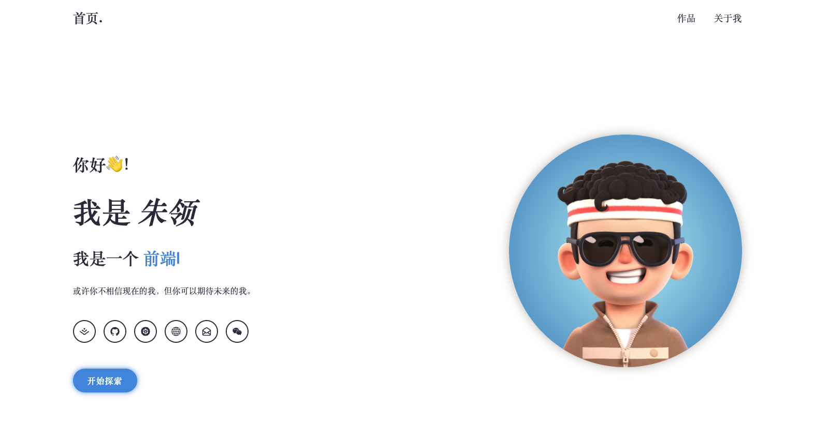
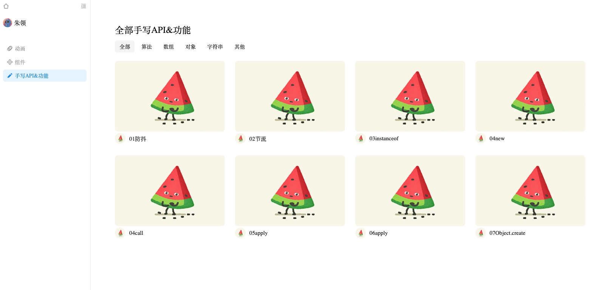

# 个人网站API接口

# 一、简介

使用`express+mongodb+webpack`实现，一个简单的后台接口

# 二、数据库

## 1.首页webInfo



```JSON
 {
    "_id": "650fcb05c9c4f3894acc2a0d",
    "author": "作者名",
    "roles": [
        "角色,前端工程师"
    ],
    "motto": "座右铭",
    "social": [
        {
            "name": "掘金9999999",
            "link": ""
        }
    ],
    bgImg: '图片链接'
    "__v": 0
}
```

## 2.作品页面



```json
{
    "_id": "650fcb05c9c4f3894acc2a0d",
    "name": "作品名",
    "desc": "css实现。。。。。。",
    "coverImg": '图片链接',
  	"link": "url",
  	"type": "作品分类",
  	"tag": [作品标签、]
    "__v": 0
}
```

## 3.关于我页面


```json
{
    "_id": "650fcb05c9c4f3894acc2a0d",
    "name": "名字",
  	"desc": "自我介绍",
    "skill": [技能树],
    "experience": {
    	name: '公司名',
      time: '时间',
      function: '职能'
    },
  	future: '成为什么样的人',
  	life: [
      urls
    ]
}
```

