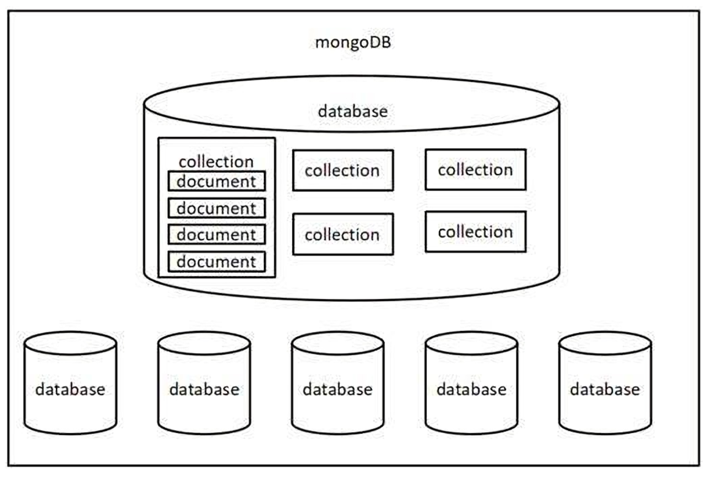

# mongodb

# 一、基本概念

MongoDB是一个跨平台，面向文档的数据库，提供高性能，高可用性和易于扩展。MongoDB是工作在集合和文档上一种概念。

MongoDB 是一个基于分布式文件存储的数据库，官方地址 https://www.mongodb.com/

## 1.数据库

数据库是一个集合的物理容器。每个数据库获取其自己设定在文件系统上的文件。一个单一的MongoDB服务器通常有多个数据库。

## 2.集合

集合是一组MongoDB的文件。它与一个RDBMS表是等效的。一个集合存在于数据库中。集合不强制执行模式。集合中的文档可以有不同的字段。通常情况下，在一个集合中的所有文件都是类似或相关目的。 

## 3.文档

文档是一组键值对。文档具有动态模式。动态模式是指，在同一个集合的文件不必具有相同一组集合的文档字段或结构，并且相同的字段可以保持不同类型的数据。

## 4.总结

数据库(database) 数据库是一个数据仓库，数据库服务下可以创建很多数据库，数据库中可以存 放很多集合

集合(collection) 集合类似于 JS 中的数组，在集合中可以存放很多文档

文档(document) 文档是数据库中的最小单位，类似于 JS 中的对象



# 二、类比JSON文件

大家可以通过 JSON 文件来理解 Mongodb 中的概念

一个好比是一个 ，一个Mongodb服务下可以有N个数据库 JSON 文件中的好比是集合
 数组中的对象好比是文档
 对象中的属性有时也称之为字段

```json
{
  "accounts": [
    {
      "id": "3-YLju5f3",
      "title": "买电脑",
      "time": "2023-02-08",
      "type": "-1",
      "account": "5500",
      "remarks": "为了上网课"
    },
    {
      "id": "3-YLju5f4",
      "title": "请女朋友吃饭",
      "time": "2023-02-08",
      "type": "-1",
      "account": "214",
      "remarks": "情人节聚餐"
    },
    {
      "id": "mRQiD4s3K",
      "title": "发工资",
      "time": "2023-02-19",
      "type": "1",
      "account": "4396",
      "remarks": "终于发工资啦!~~"
    }
  ],
  "users": [
    {
      "id": 1,
      "name": "zhangsan",
      "age": 18
    },
    {
      "id": 2,
      "name": "lisi",
      "age": 20
    },
    {
      "id": 3,
      "name": "wangwu",
      "age": 22
    }
  ]
}
```

# 三、命令行交互

## 1. 数据库命令
### 显示所有的数据库

```
show dbs
```

所创建的数据库（mydb）不存在于列表中。要显示的数据库，需要至少插入一个文档进去。

### 切换到指定的数据库，

如果数据库不存在会自动创建数据库 use 数据库名

```
use 数据库名
```

### 显示当前所在的数据库

```
db
```

### 删除当前数据库

```
use 库名 db.dropDatabase()
```

## 2.集合命令

### 创建集合

MongoDB 的 **db.createCollection(name, options)** 用于创建集合。 在命令中, **name** 是要创建集合的名称。 **Options** 是一个文档，用于指定集合的配置

| 参数    | 类型     | 描述                               |
| ------- | -------- | ---------------------------------- |
| Name    | String   | 要创建的集合的名称                 |
| Options | Document | （可选）指定有关内存大小和索引选项 |

**选项列表**

| 字段        | 类型    | 描述                                                         |
| ----------- | ------- | ------------------------------------------------------------ |
| capped      | Boolean | （可选）如果为true，它启用上限集合。上限集合是一个固定大小的集合，当它达到其最大尺寸会自动覆盖最老的条目。 如果指定true，则还需要指定参数的大小。 |
| autoIndexID | Boolean | （可选）如果为true，自动创建索引_id字段。默认的值是 false.   |
| size        | number  | （可选）指定的上限集合字节的最大尺寸。如果capped 是true，那么还需要指定这个字段。 |
| max         | number  | （可选）指定上限集合允许的最大文件数。                       |

MongoDB首先检查字段集合的上限大小，那么它会检查最大字段。

```js
>db.createCollection("mycol", { capped : true, autoIndexID : true, size : 6142800, max : 10000 } )
{ "ok" : 1 }
>
```

在MongoDB中并不需要创建集合。 当插入一些文档 MongoDB 会自动创建集合。

```js
>db.yiibai.insert({"name" : "yiibai"})
>show collections
mycol
mycollection
system.indexes
yiibai
>
```

### 显示当前数据库中的所有集合

```
show collections
```

### 删除某个集合

```
db.集合名.drop()
```

### 重命名集合

```
db.集合名.renameCollection('newName')
```

## 3.**文档命令**

### 插入文档

```
db.集合名.insert(文档对象);
```

```
>db.mycol.insert({
   _id: ObjectId(7df78ad8902c),
   title: 'MongoDB Overview', 
   description: 'MongoDB is no sql database',
   by: 'yiibai tutorials',
   url: 'http://www.yiibai.com',
   tags: ['mongodb', 'database', 'NoSQL'],
   likes: 100
})
```

要以单个查询插入多个文档，可以通过文档 insert() 命令的数组方式。

```js
>db.post.insert([
{
   title: 'MongoDB Overview', 
   description: 'MongoDB is no sql database',
   by: 'yiibai tutorials',
   url: 'http://www.yiibai.com',
   tags: ['mongodb', 'database', 'NoSQL'],
   likes: 100
},
{
   title: 'NoSQL Database', 
   description: 'NoSQL database doesn't have tables',
   by: 'yiibai tutorials',
   url: 'http://www.yiibai.com',
   tags: ['mongodb', 'database', 'NoSQL'],
   likes: 20, 
   comments: [	
      {
         user:'user1',
         message: 'My first comment',
         dateCreated: new Date(2013,11,10,2,35),
         like: 0 
      }
   ]
}
])
```

### 查询文档

#### 基础

```
db.集合名.find(查询条件)
```

_id 是 mongodb 自动生成的唯一编号，用来唯一标识文档

find() 方法将在非结构化的方式显示所有的文件。 如果显示结果是格式化的，那么可以用pretty() 方法。

```
>db.mycol.find().pretty()
```

```
>db.mycol.find().pretty()
{
   "_id": ObjectId(7df78ad8902c),
   "title": "MongoDB Overview", 
   "description": "MongoDB is no sql database",
   "by": "yiibai tutorials",
   "url": "http://www.yiibai.com",
   "tags": ["mongodb", "database", "NoSQL"],
   "likes": "100"
}
>
```

除了find()方法还有findOne()方法，仅返回一个文档。

#### SQL等价

**RDBMS Where子句等效于MongoDB**

查询文档在一些条件的基础上，可以使用下面的操作

| 操作                | 语法 | 示例                                              | RDBMS等效语句                 |
| ------------------- | ---- | ------------------------------------------------- | ----------------------------- |
| Equality            | :    | db.mycol.find({"by":"yiibai tutorials"}).pretty() | where by = 'yiibai tutorials' |
| Less Than           | $lt  | db.mycol.find({"likes":{$lt:50}}).pretty()        | where likes < 50              |
| Less Than Equals    | $lte | db.mycol.find({"likes":{$lte:50}}).pretty()       | where likes <= 50             |
| Greater Than        | $gt  | db.mycol.find({"likes":{$gt:50}}).pretty()        | where likes > 50              |
| Greater Than Equals | $gte | db.mycol.find({"likes":{$gte:50}}).pretty()       | where likes >= 50             |
| Not Equals          | $ne  | db.mycol.find({"likes":{$ne:50}}).pretty()        | where likes != 50             |

#### 与：AND

在 find()方法，如果您传递多个键通过","将它们分开，那么MongoDB对待它就如AND条件一样。基本语法如下所示：

```
>db.mycol.find({key1:value1, key2:value2}).pretty()
```

下面给出的例子将显示所有教程含“yiibai tutorials”和其标题是“MongoDB Overview”

```
>db.mycol.find({"by":"yiibai tutorials","title": "MongoDB Overview"}).pretty()
{
   "_id": ObjectId(7df78ad8902c),
   "title": "MongoDB Overview", 
   "description": "MongoDB is no sql database",
   "by": "yiibai tutorials",
   "url": "http://www.yiibai.com",
   "tags": ["mongodb", "database", "NoSQL"],
   "likes": "100"
}
>
```

对于上面给出的例子相当于where子句：' where by='yiibai tutorials' AND title='MongoDB Overview' '。可以传递任何数目的键-值对在find子句。

#### 或：OR

要查询基于OR条件的文件，需要使用$or关键字。OR的基本语法如下所示：

```
>db.mycol.find(
   {
      $or: [
	     {key1: value1}, {key2:value2}
      ]
   }
).pretty()
```

下面给出的例子将显示所有撰写含有 'yiibai tutorials' 或是标题为 'MongoDB Overview' 的教程

```
>db.mycol.find({$or:[{"by":"tutorials point"},{"title": "MongoDB Overview"}]}).pretty()
{
   "_id": ObjectId(7df78ad8902c),
   "title": "MongoDB Overview", 
   "description": "MongoDB is no sql database",
   "by": "yiibai tutorials",
   "url": "http://www.yiibai.com",
   "tags": ["mongodb", "database", "NoSQL"],
   "likes": "100"
}
>
```

#### AND 和 OR 在一起

下面给出的例子显示有喜欢数大于100 的文档，其标题要么是 'MongoDB Overview' 或 'yiibai tutorials'. 等效于SQL的where子句：**'where likes>10 AND (by = 'yiibai tutorials' OR title = 'MongoDB Overview')'**

```
>db.mycol.find("likes": {$gt:10}, $or: [{"by": "yiibai tutorials"}, {"title": "MongoDB Overview"}] }).pretty()
{
   "_id": ObjectId(7df78ad8902c),
   "title": "MongoDB Overview", 
   "description": "MongoDB is no sql database",
   "by": "yiibai tutorials",
   "url": "http://www.yiibai.com",
   "tags": ["mongodb", "database", "NoSQL"],
   "likes": "100"
}
>
```

### 更新文档

MongoDB的update()和save()方法用于更新文档到一个集合。 update()方法将现有的文档中的值更新，而save()方法使用传递到save()方法的文档替换现有的文档。 

#### update

```
db.集合名.update(查询条件,新的文档) 
db.集合名.update({name:'张三'},{$set:{age:19}})
```

考虑mycol集合有如下数据。

```
{ "_id" : ObjectId(5983548781331adf45ec5), "title":"MongoDB Overview"}
{ "_id" : ObjectId(5983548781331adf45ec6), "title":"NoSQL Overview"}
{ "_id" : ObjectId(5983548781331adf45ec7), "title":"Yiibai Yiibai Overview"}
```

下面的例子将设置其标题“MongoDB Overview”的文件为新标题为“New MongoDB Tutorial”

```
>db.mycol.update({'title':'MongoDB Overview'},{$set:{'title':'New MongoDB Tutorial'}})
>db.mycol.find()
{ "_id" : ObjectId(5983548781331adf45ec5), "title":"New MongoDB Tutorial"}
{ "_id" : ObjectId(5983548781331adf45ec6), "title":"NoSQL Overview"}
{ "_id" : ObjectId(5983548781331adf45ec7), "title":"Yiibai Tutorial Overview"}
>
```

默认情况下，MongoDB将只更新单一文件，更新多，需要一个参数 'multi' 设置为 true。

```
>db.mycol.update({'title':'MongoDB Overview'},{$set:{'title':'New MongoDB Tutorial'}},{multi:true})
```

#### save

save() 方法取代，通过新文档到 save()方法

下面的例子将替换该文件_id '5983548781331adf45ec7'

```
>db.mycol.save(
   {
      "_id" : ObjectId(5983548781331adf45ec7), "title":"Yiibai Yiibai New Topic", "by":"Yiibai Yiibai"
   }
)
>db.mycol.find()
{ "_id" : ObjectId(5983548781331adf45ec5), "title":"Yiibai Yiibai New Topic", "by":"Yiibai Yiibai"}
{ "_id" : ObjectId(5983548781331adf45ec6), "title":"NoSQL Overview"}
{ "_id" : ObjectId(5983548781331adf45ec7), "title":"Yiibai Yiibai Overview"}
>
```

### 删除文档

```
db.集合名.remove(查询条件)
```

MongoDB 的 **remove()**方法用于从集合中删除文档。remove()方法接受两个参数。一个是标准缺失，第二是justOne标志

1. **deletion criteria :** 根据文件（可选）删除条件将被删除。
2. **justOne :** （可选）如果设置为true或1，然后取出只有一个文档

### MongoDB投影

mongodb投影意义是只选择需要的数据，而不是选择整个一个文档的数据。如果一个文档有5个字段，只需要显示3个，只从中选择3个字段。

MongoDB的find()方法，解释了MongoDB中查询文档接收的第二个可选的参数是要检索的字段列表。在MongoDB中，当执行find()方法，那么它会显示一个文档的所有字段。要限制这一点，需要设置字段列表值为1或0。1是用来显示字段，而0被用来隐藏字段。

find()方法的基本语法如下

```
>db.COLLECTION_NAME.find({},{KEY:1})
```

考虑集合 **myycol** 有下列数据

```
{ "_id" : ObjectId(5983548781331adf45ec5), "title":"MongoDB Overview"}
{ "_id" : ObjectId(5983548781331adf45ec6), "title":"NoSQL Overview"}
{ "_id" : ObjectId(5983548781331adf45ec7), "title":"Yiibai Yiibai Overview"}
```

下面的例子将显示文档的标题，在查询文档时。

```
>db.mycol.find({},{"title":1,_id:0})
{"title":"MongoDB Overview"}
{"title":"NoSQL Overview"}
{"title":"Yiibai Yiibai Overview"}
>
```

请注意在执行find()方法时_id字段始终显示，如果不想要显示这个字段，那么需要将其设置为0

### 限制文档Limit()

要在MongoDB中限制记录，需要使用limit()方法。 limit() 方法接受一个数字类型的参数，这是要显示的文档数量。

limit()方法的基本语法如下

```
>db.COLLECTION_NAME.find().limit(NUMBER)
```

考虑集合 myycol 有下列数据

```
{ "_id" : ObjectId(5983548781331adf45ec5), "title":"MongoDB Overview"}
{ "_id" : ObjectId(5983548781331adf45ec6), "title":"NoSQL Overview"}
{ "_id" : ObjectId(5983548781331adf45ec7), "title":"Yiibai Yiibai Overview"}
```

下面的例子将只显示2个文档，在查询文档时。

```
>db.mycol.find({},{"title":1,_id:0}).limit(2)
{"title":"MongoDB Overview"}
{"title":"NoSQL Overview"}
>
```

如果不指定 **limit()**方法的参数数量，然后它会显示集合中的所有文档。

### 文档跳过Skip() 

除了 **limit()**方法还有一个方法 **skip()**也接受数字类型参数并用于跳过文件数。

skip() 方法的基础语法如下所示：

```
>db.COLLECTION_NAME.find().limit(NUMBER).skip(NUMBER)
```

下面的例子将仅显示第二个文档。

```
>db.mycol.find({},{"title":1,_id:0}).limit(1).skip(1)
{"title":"NoSQL Overview"}
>
```

请注意，skip() 方法的默认值是 0

### 文档排序sort()

要排序MongoDB中的文档，需要使用 sort()方法。 sort() 方法接受一个包含字段列表以及排序顺序的文档。 要使用1和-1指定排序顺序。1用于升序，而-1是用于降序。

```
>db.COLLECTION_NAME.find().sort({KEY:1})
```

考虑集合 myycol 有如下数据

```
{ "_id" : ObjectId(5983548781331adf45ec5), "title":"MongoDB Overview"}
{ "_id" : ObjectId(5983548781331adf45ec6), "title":"NoSQL Overview"}
{ "_id" : ObjectId(5983548781331adf45ec7), "title":"Yiibai Yiibai Overview"}
```

下面的例子将显示的文件排序按标题降序排序。

```
>db.mycol.find({},{"title":1,_id:0}).sort({"title":-1})
{"title":"Yiibai Yiibai Overview"}
{"title":"NoSQL Overview"}
{"title":"MongoDB Overview"}
>
```

请注意，如果不指定排序类型，那么 sort() 方法将以升序排列文档。


# 四、特点

下面列出的是MongoDB的一些重要功能特性：

**1.支持特别查询**

- 在MongoDB中，可以通过字段，范围查询进行搜索，并且还支持正则表达式搜索。

**2.索引**

- 可以索引文档中的任何字段。

**3.复制**

- MongoDB支持主从复制。主机可以执行读写操作，从机从主机复制数据，只能用于读取或备份(不写入)

**4.复制数据**

- MongoDB可以在多台服务器上运行。 复制数据以保持系统正常运行，并在硬件故障的情况下保持其运行状态。

**5.负载均衡**

- 由于数据放在碎片中，因此具有自动负载平衡配置。

**6.支持映射缩减和聚合工具**

**7.使用JavaScript而不是Procedure**

**8.它是一个用C++编写的无模式数据库**

**9.提供高性能**

**10.轻松存储任何大小的文件，而不会使您的堆栈复杂化**

**11.在故障的情况下易于管理**

**12.它还支持：**

- 具有动态模式的JSON数据模型
- 自动分片用于水平可扩展性
- 内置复制高可用性

# 五、优点

## MongoDB优点

- MongoDB 的架构较少。它是一个文档数据库，它的一个集合持有不同的文档。
- 从一个到另一个的文档的数量，内容和大小可能有差异。
- MongoDB 中单个对象的结构很清淅。
- MongoDB 中没有复杂的连接。
- MongoDB 提供深度查询的功能，因为它支持对文档的强大的动态查询。
- MongoDB 很容易扩展。
- 它使用内部存储器来存储工作集，这是其快速访问的原因。

## MongoDB的独特功能

- 使用方便
- 重量轻/轻量级
- 比RDBMS快得多

## 应该使用MongoDB在哪些场景

- 大而复杂的数据
- 移动和社会基础设施数据
- 内容管理和交付
- 用户数据管理
- 数据中心

## MongoDB和RDBMS的性能分析

- 在关系数据库(RDBMS)中，表用作存储元素，而在 MongoDB 中使用的是集合。
- 在RDBMS中有多个模式，在每个模式中，可创建用于存储数据的表，而 MongoDB 是面向文档的数据库，数据是以类似[JSON](http://www.yiibai.com/json/)格式的BSON格式编写的存储的。
- MongoDB几乎比传统数据库系统快100倍。


[教程](https://www.yiibai.com/mongodb/mongodb_quick_guide.html)