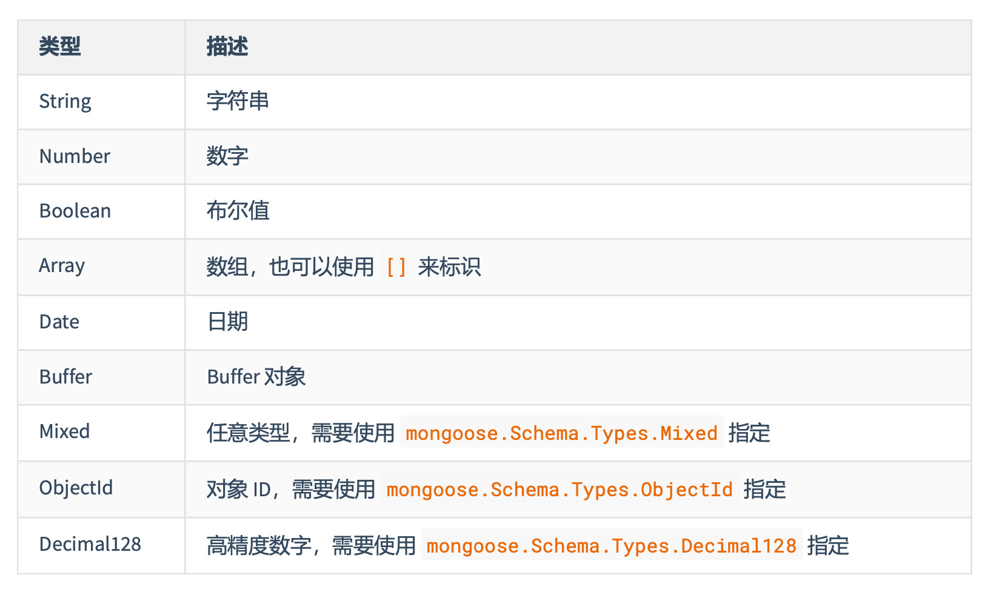
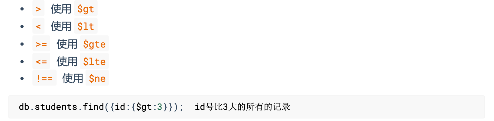

# 01基本介绍与使用

# 一、介绍

Mongoose 是一个对象文档模型库，官网 http://www.mongoosejs.net/，方便使用代码操作 mongodb 数据库

# 二、使用流程

```js
//1. 安装 mongoose
//2. 导入 mongoose
const mongoose = require('mongoose');
//3. 连接数据库 mongoose.connect('mongodb://127.0.0.1:27017/bilibili');
//4. 设置连接回调
//连接成功 mongoose.connection.on('open', () => {
console.log('连接成功');
//5. 创建文档结构对象
let BookSchema = new mongoose.Schema({
    title: String,
    author: String,
    price: Number
});
//6. 创建文档模型对象
let BookModel = mongoose.model('book', BookSchema);
//7. 插入文档 
BookModel.create({
		title: '西游记', 
  	author: '吴承恩', 
  	price: 19.9
  }, (err, data) => {
    if (err) throw err;
    //输出 data 对象 console.log(data); //8. 断开连接 mongoose.disconnect();
	});
});
//连接出错 mongoose.connection.on('error', () => {
console.log('连接出错~~'); })
//连接关闭 mongoose.connection.on('close', () => {
console.log('连接关闭'); })
```

# 三、字段类型



# 四、字段值验证
**必填项**

```
title: {
    type: String,
    required: true // 设置必填项
},
```

**默认值**

```
author: {
    type: String,
    default: '匿名' //默认值 
},
```

**枚举值**

```
gender: {
    type: String,
		enum: ['男','女'] //设置的值必须是数组中的 
},
```

**唯一值**

```
username: {
    type: String,
    unique: true
},
```

unique 需要 重建集合 才能有效果 永远不要相信用户的输入

# 五、CURD

数据库的基本操作包括四个，增加(create)，删除(delete)，修改(update)，查(read)

## 1.增加
### 插入一条

```
SongModel.create({ 
	title:'给我一首歌的时间', 
	author: 'Jay'
}, function(err, data){ //错误
	console.log(err); //插入后的数据对象 console.log(data);
});
```

### 批量插入

```
//1.引入mongoose
const mongoose = require('mongoose');
//2.链接mongodb数据库 connect 连接
mongoose.connect('mongodb://127.0.0.1:27017/project');
//3.设置连接的回调 
mongoose.connection.on('open',()=>{
//4.声明文档结构
const PhoneSchema = new mongoose.Schema({
         brand:String,
         color:String,
         price:Number,
         tags:Array
    })
//6.创建模型对象
const PhoneModel = mongoose.model('phone',PhoneSchema);
    PhoneModel.insertMany([
        {
          brand:'华为',
          color:'灰色',
          price:2399, tags:['电量大','屏幕大','信号好']
				}, {
          brand:'小米',
          color:'白色',
          price:2099, tags:['电量大','屏幕大','信号好']
        }
    ],(err,data)=>{
				if(err) throw err; console.log('写入成功'); 
				mongoose.connection.close();
		}) 
})
```

## 2. **删除**

### 删除一条数据

```
SongModel.deleteOne({_id:'5dd65f32be6401035cb5b1ed'}, function(err){ if(err) throw err;
  console.log('删除成功');
  mongoose.connection.close();
});
```

### 批量删除

```
SongModel.deleteMany({author:'Jay'}, function(err){ if(err) throw err;
	console.log('删除成功'); 
	mongoose.connection.close();
});
```

## 3.更新

### 更新一条数据

```
SongModel.updateOne({author: 'JJ Lin'}, {author: '林俊杰'}, 
	function (err) { 
		if(err) throw err;
		mongoose.connection.close();
});
```

### 批量更新数据

```
SongModel.updateMany({author: 'Leehom Wang'}, {author: '王力宏'}, function (err) { 
	if(err) throw err;
	mongoose.connection.close();
});
```

## 4.查询

### 查询一条数据

```
SongModel.findOne({author: '王力宏'}, function(err, data){ if(err) throw err;
    console.log(data);
    mongoose.connection.close();
});
//根据 id 查询数据 SongModel.findById('5dd662b5381fc316b44ce167',function(err, data){
    if(err) throw err;
    console.log(data);
    mongoose.connection.close();
});
```

### 批量查询数据

```
//不加条件查询 
SongModel.find(function(err, data){
    if(err) throw err;
    console.log(data);
    mongoose.connection.close();
});
//加条件查询
SongModel.find({author: '王力宏'}, function(err, data){
    if(err) throw err;
    console.log(data);
    mongoose.connection.close();
});
```

# 六、条件控制

## 1.运算符

在 mongodb 不能 `> < >= <= !==` 等运算符，需要使用替代符号



## 2.逻辑运算

### $or 逻辑或

```
db.students.find({$or:[{age:18},{age:24}]});
```

### $and 逻辑与的情况

```
db.students.find({$and: [{age: {$lt:20}}, {age: {$gt: 15}}]});
```

### 正则匹配
条件中可以直接使用 JS 的正则语法，通过正则可以进行模糊查询

```
db.students.find({name:/imissyou/});
```

# 七、个性化读取

## 1.字段筛选

```js
//0:不要的字段
//1:要的字段 
SongModel.find().select({_id:0,title:1}).exec(function(err,data){
    if(err) throw err;
    console.log(data);
    mongoose.connection.close();
});
```

## 2.数据排序

```
//sort 排序
//1:升序
//-1:倒序 
SongModel.find().sort({hot:1}).exec(function(err,data){
    if(err) throw err;
    console.log(data);
    mongoose.connection.close();
});
```

## 3.数据截取

```
//skip 跳过 limit 限定 
SongModel.find().skip(10).limit(10).exec(function(err,data){
    if(err) throw err;
    console.log(data);
    mongoose.connection.close();
});
```


